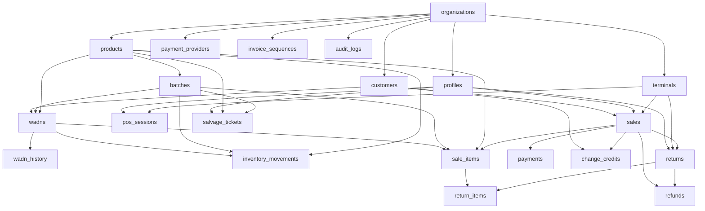

# Avero Database Schema & CSV Templates

This directory contains schema CSV templates and seed fixtures for the **Avero Retail OS & POS Engine**.
All files follow RFC 4180 CSV standard conventions with typed headers and production-grade sample data.

---

## Table of Contents & Description of Tables

| # | CSV File | Corresponding Database Table | Description |
|---|----------|------------------------------|-------------|
| 1 | `organizations.csv` | `public.organizations` | Multi-tenant root entity representing stores, chains, and business organizations. |
| 2 | `profiles.csv` | `public.profiles` | Staff and employee profiles linked to `auth.users`, with roles (`owner`, `manager`, `cashier`) and granular permissions. |
| 3 | `customers.csv` | `public.customers` | Store patrons identified by phone number, tracking loyalty tiers and `available_change_credit`. |
| 4 | `products.csv` | `public.products` | Product catalog with SKU, barcode, unit, HSN, tax rate, and serialized tracking flags. |
| 5 | `batches.csv` | `public.batches` | Lot/batch tracking with manufacturing dates, expiry dates, supplier details, cost price, and distributor return windows. |
| 6 | `wadns.csv` | `public.wadns` | Warranty & Asset Digital Nodes for individually serialized high-value units (earbuds, electronics, appliances). |
| 7 | `wadn_history.csv` | `public.wadn_history` | Immutable chronological audit trail of serialized node lifecycles (receiving, transfer, sale, repair, return). |
| 8 | `inventory_movements.csv` | `public.inventory_movements` | Stock ledger tracking double-entry style stock movements (Receiving, Sale, Shrinkage, Return, Transfer). |
| 9 | `sales.csv` | `public.sales` | Point-of-sale invoice header records with subtotal, tax, split payment totals, and change credit issuances. |
| 10 | `sale_items.csv` | `public.sale_items` | Individual line items on a sales invoice, capturing price snapshots, taxes, discounts, and linked batch/WADN. |
| 11 | `payments.csv` | `public.payments` | Payment ledger entries supporting split tenders (Cash, UPI, Card, Net Banking, Change Credit). |
| 12 | `change_credits.csv` | `public.change_credits` | Store credit vouchers generated when cashiers lack exact change, redeemable by customer phone number. |
| 13 | `returns.csv` | `public.returns` | Sales return and item refund requests authorized by managerial staff with condition evaluations. |
| 14 | `return_items.csv` | `public.return_items` | Granular item line records for returns with defect classifications and item dispositions (Restock, Repair, Scrap). |
| 15 | `refunds.csv` | `public.refunds` | Financial reimbursement transactions issued via original tender or alternative store credit. |
| 16 | `terminals.csv` | `public.terminals` | Hardware billing counters and POS workstation registers with PIN security credentials and peripheral configuration. |
| 17 | `pos_sessions.csv` | `public.pos_sessions` | Cashier shift sessions with cryptographically verified session tokens and heartbeat monitoring. |
| 18 | `audit_logs.csv` | `public.audit_logs` | Comprehensive security and compliance audit log capturing actor IDs, events, and operational context. |
| 19 | `invoice_sequences.csv` | `public.invoice_sequences` | Atomic sequence counters and custom alphanumeric prefixes for invoices, returns, credit notes, and movements. |
| 20 | `payment_providers.csv` | `public.payment_providers` | Gateway and local payment terminal integrations (Cash drawer, UPI dynamic QR, Pine Labs POS, Stripe). |
| 21 | `salvage_tickets.csv` | `public.salvage_tickets` | Actionable recovery tasks for short-dated perishables (Distributor Return, Markdown Liquidation, Donation). |

---

## Foreign Key Relationships & Import Sequence

When importing these CSV files into PostgreSQL / Supabase, adhere to the following dependency order:

### Recommended Import Order:
1. `organizations.csv`
2. `profiles.csv`
3. `customers.csv`
4. `products.csv`
5. `batches.csv`
6. `terminals.csv`
7. `wadns.csv`
8. `wadn_history.csv`
9. `pos_sessions.csv`
10. `inventory_movements.csv`
11. `sales.csv`
12. `sale_items.csv`
13. `payments.csv`
14. `change_credits.csv`
15. `returns.csv`
16. `return_items.csv`
17. `refunds.csv`
18. `payment_providers.csv`
19. `invoice_sequences.csv`
20. `salvage_tickets.csv`
21. `audit_logs.csv`

---

## Data Conventions & Types

- **UUIDs**: All primary and foreign keys use canonical standard UUIDv4 format (`11111111-1111-1111-1111-111111111101`).
- **Timestamps**: All dates and timestamps are formatted in ISO 8601 UTC (`YYYY-MM-DDTHH:MM:SSZ`).
- **Currency & Money**: Decimal values (`numeric(12,2)`) are denominated in INR (₹).
- **JSON Fields**: Extended metadata, hardware settings, and permissions are stored as RFC 7159 compliant JSON strings escaped per CSV standards (`"{""key"": ""value""}"`).
- **Null Values**: Optional fields with no initial values are represented as empty fields without quotes (e.g. `,,`).
